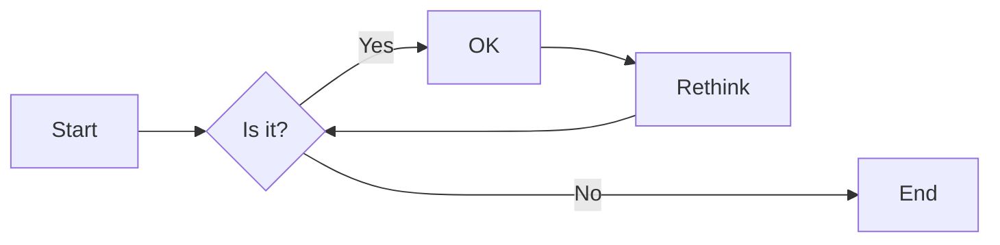
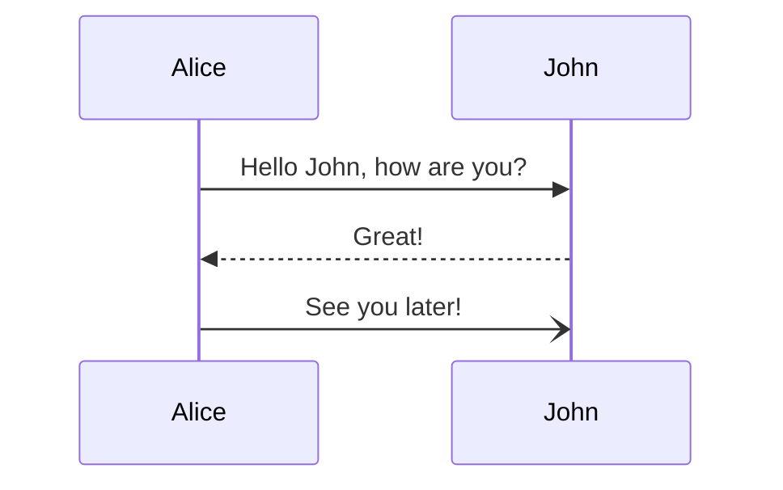
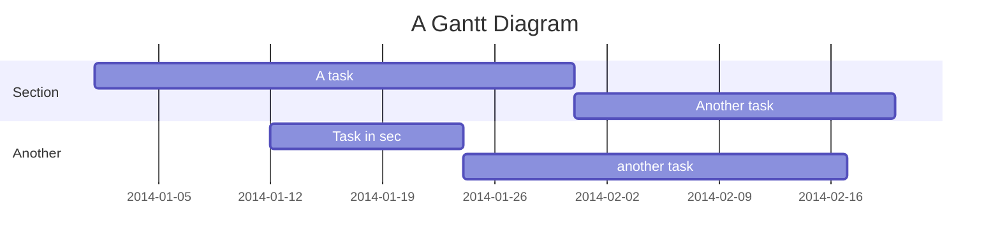
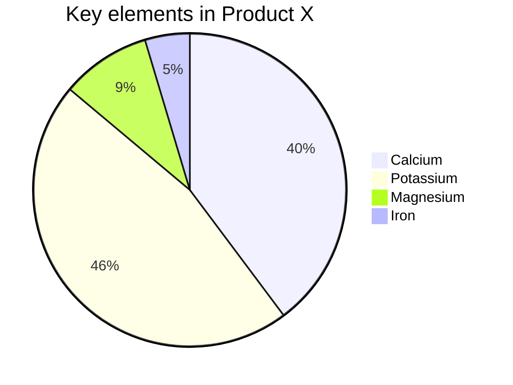

# Mermaid構文サンプル

## フローチャート
Reference: [Flowcharts - Basic Syntax](https://mermaid-js.github.io/mermaid/#/flowchart)

## シーケンス図

## ガントチャート

## クラス図

## Gitグラフ

## ER図

## カスタマージャーニーマップ

## 円グラフ

